## Particles

### Fire

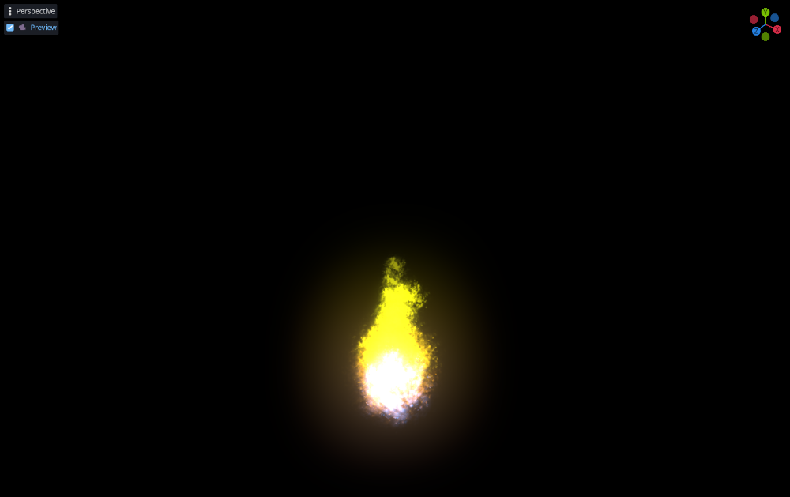

### Hurricane

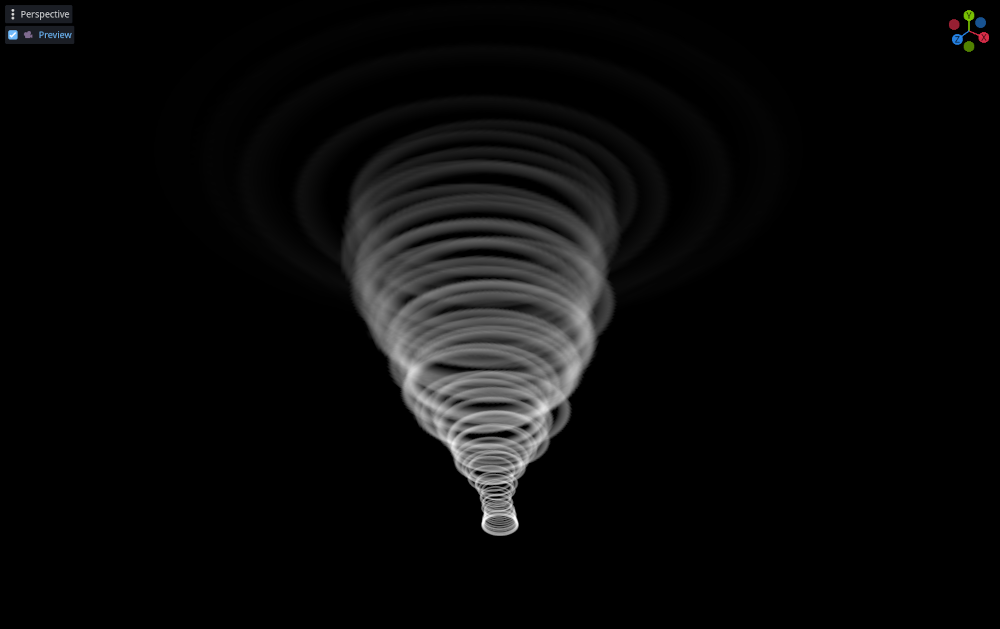

### Hyperdrive

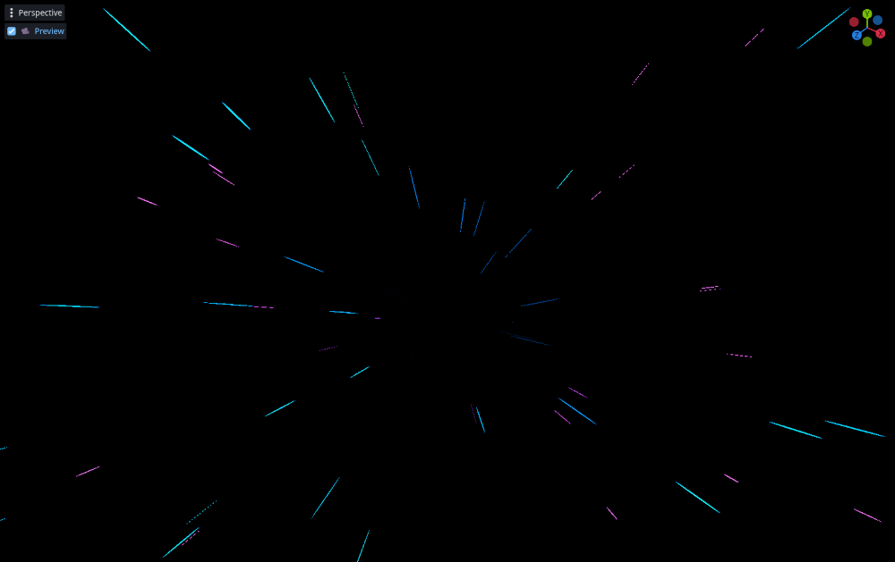

### Shield

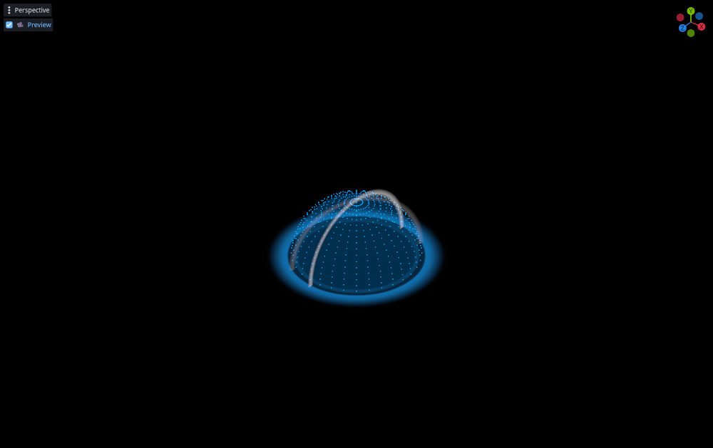

### Smoke

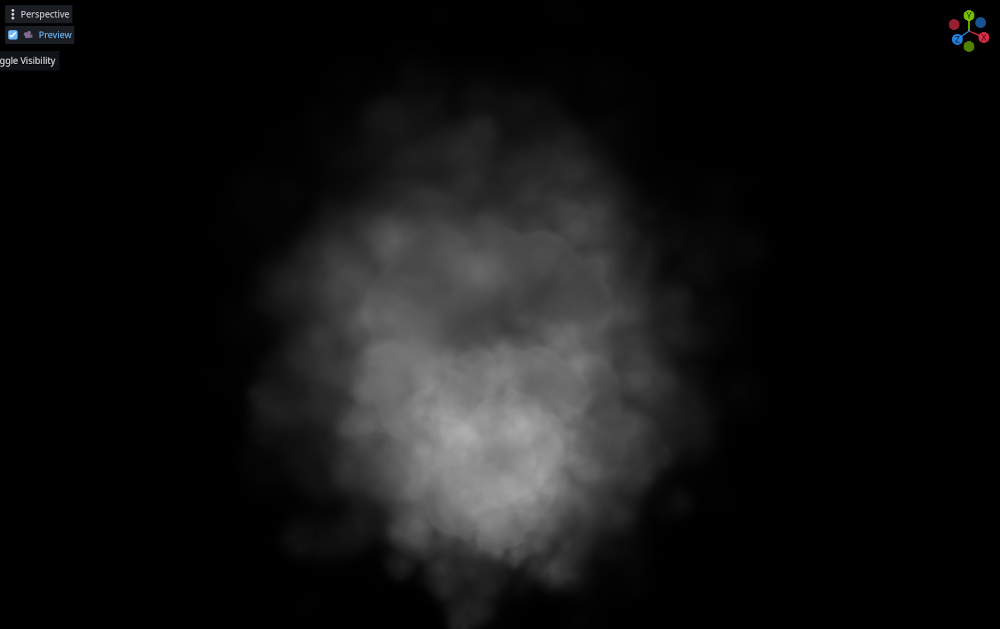

### Sparks

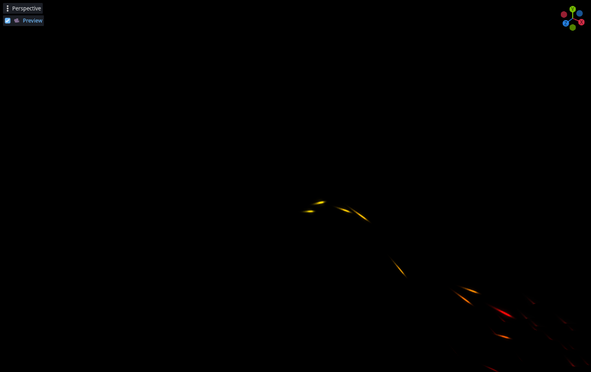

### Rain

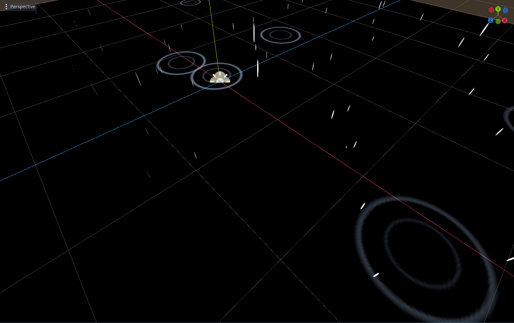

## Camera Effects

These effects should be place in a CanvasLayer object in any scene

### Chromatic Aberration

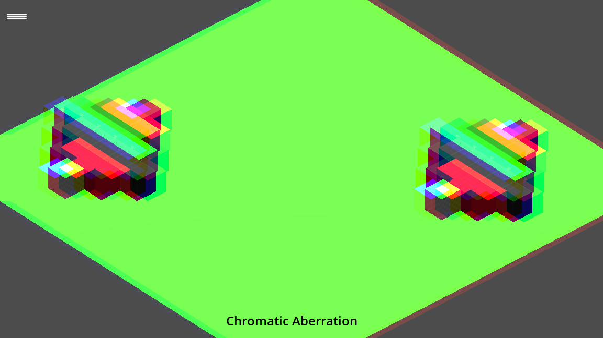

### Grain Noise

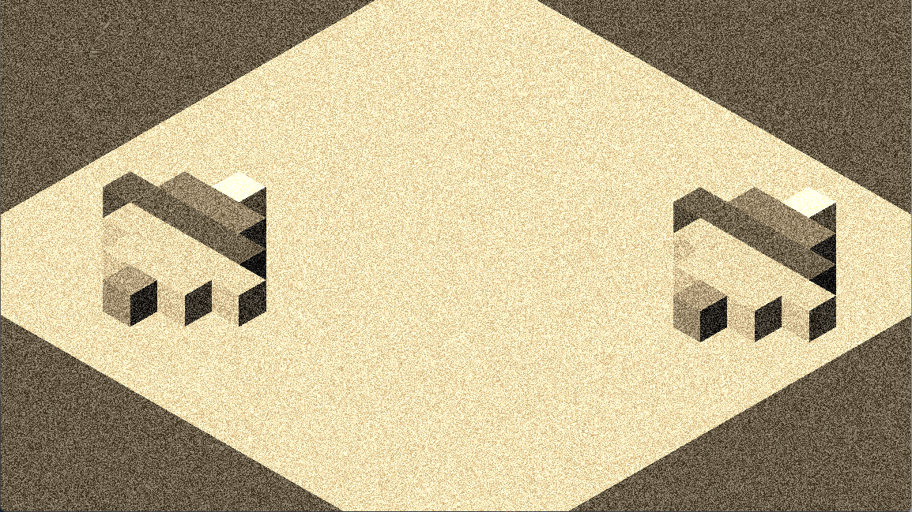

### Hexagon Mosaic

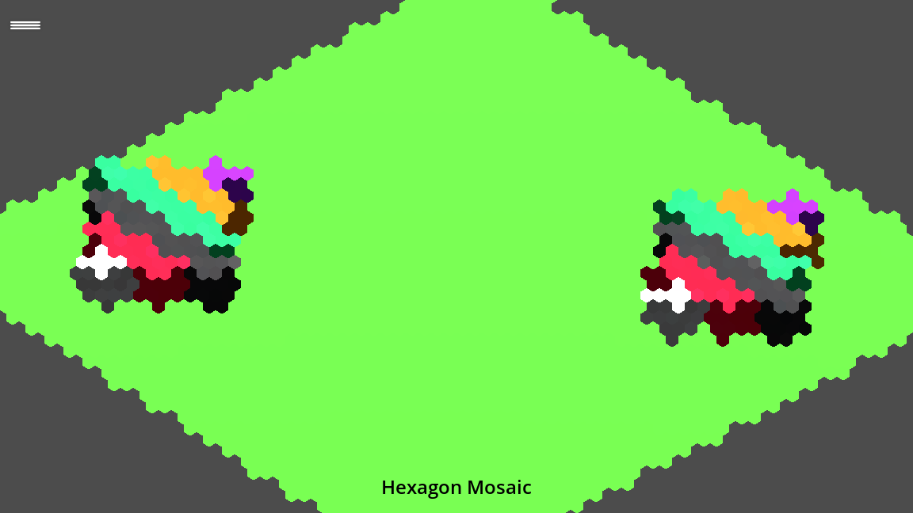

### Pixelate

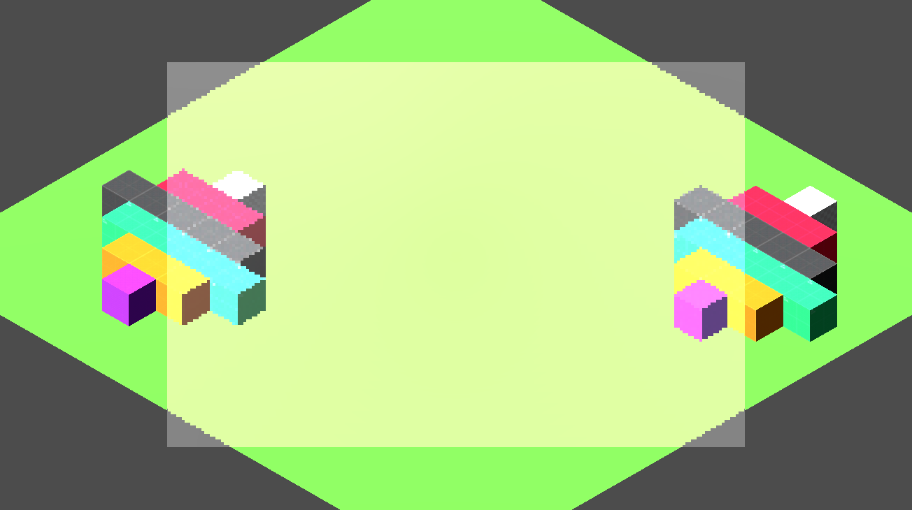

### Sepia

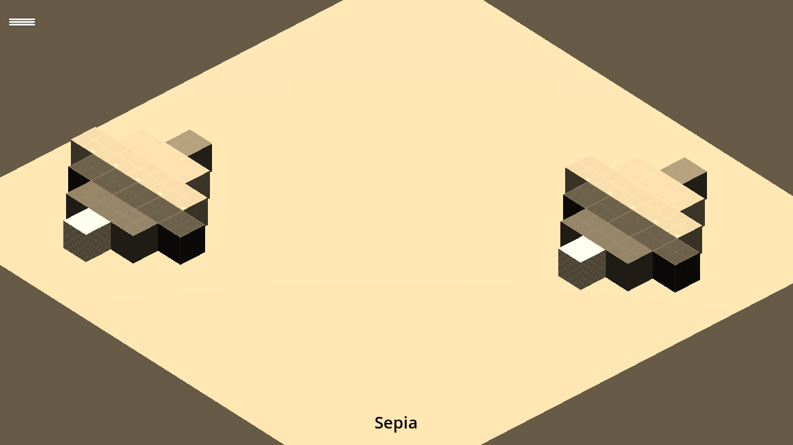

### Vignette (danger)

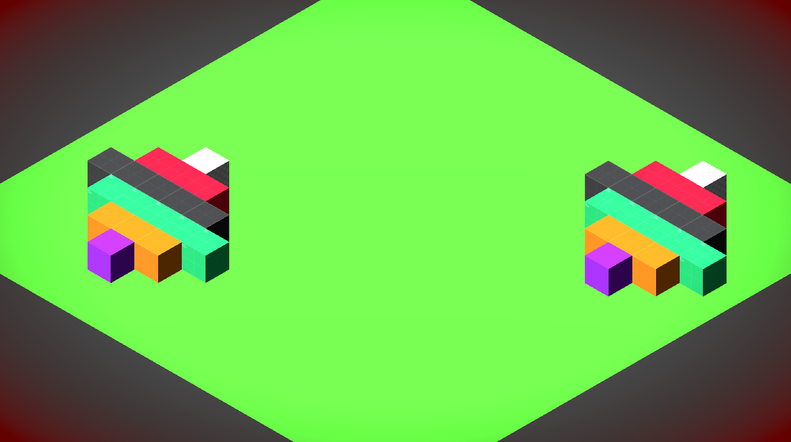

### Camera Shake

<video src="./docs/images/camera-effects/camera-shake.mp4" width="1152" height="648" controls></video>

## License

* Kenney Particle Pack is copyrighted by Kenney, and can be found at https://kenney.nl/assets/particle-pack
* Kenney Prototype Tools is copyrighted by Kenney, and can be found at https://github.com/GeroVeni/kenney_prototype_tools
* Kaykit Halloween Bits is copyrighted by Kay Lousberg, and can be found at https://kaylousberg.itch.io/halloween-bits

Except for that, the particles and code in this repository are available under MIT license for free usage.
