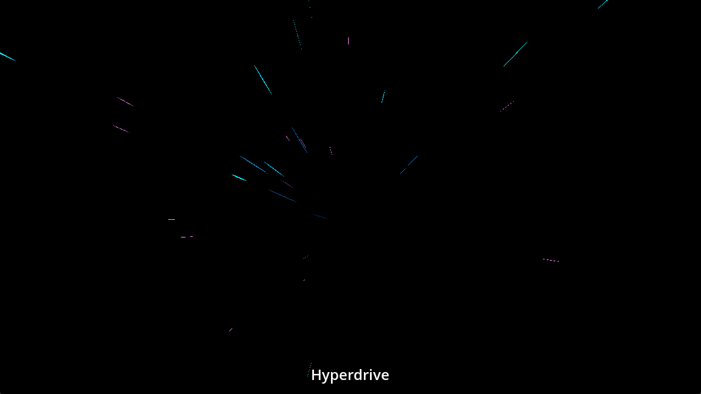
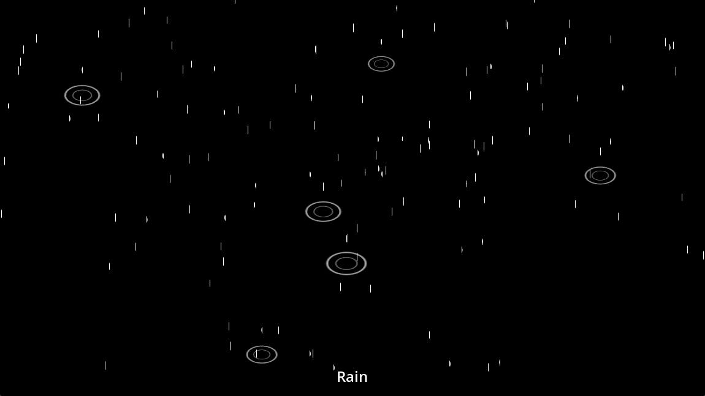

## Particles

### Fire

### Hurricane

### Hyperdrive

### Shield

### Smoke

### Sparks

### Rain

## License

* Kenney Particle Pack is copyrighted by Kenney, and can be found at https://kenney.nl/assets/particle-pack
* Kenney Prototype Tools is copyrighted by Kenney, and can be found at https://github.com/GeroVeni/kenney_prototype_tools

Except for that, the particles and code in this repository are available under MIT license for free usage.