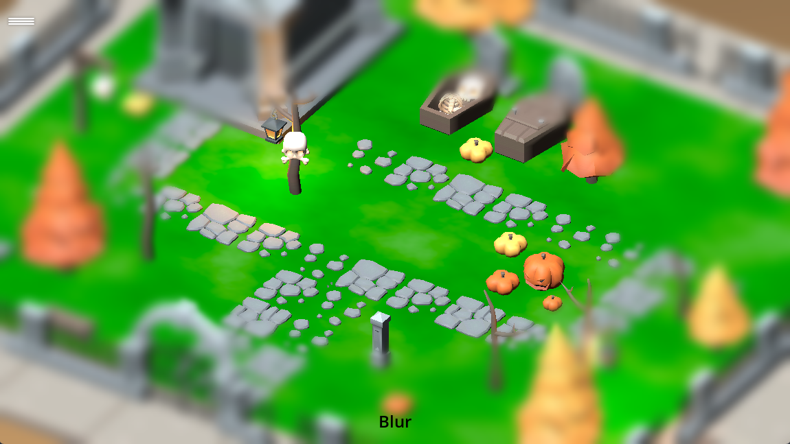
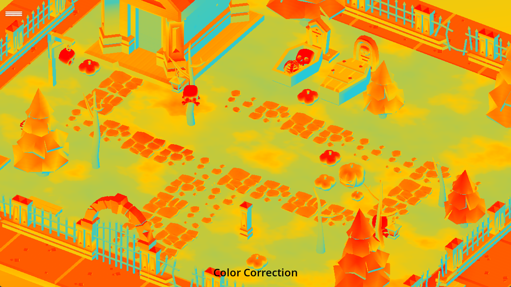
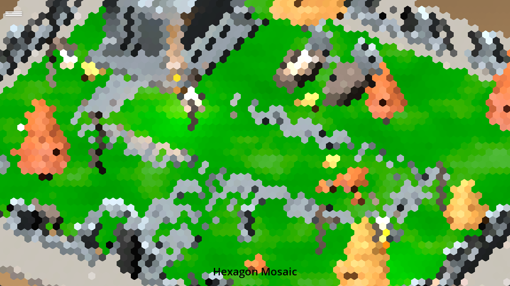
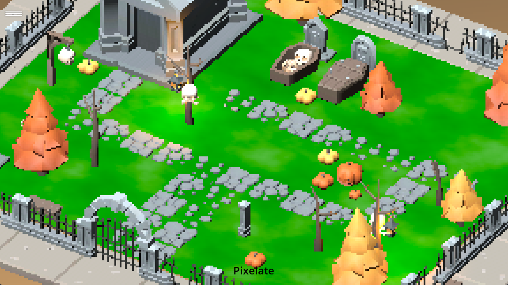

## Particles

### Fire

### Hurricane

### Hyperdrive

### Impact

### Implosion

### Rain

### Ring Portal

### Shield

### Shockwave

### Smoke

### Sparks

### Rain

## Camera Effects

These effects should be place in a CanvasLayer object in any scene

### Blur

based on: https://godotshaders.com/shader/simple-blur-mixed-with-a-color/

### Camera Shake

### Chromatic Aberration

based on: https://www.youtube.com/watch?v=aVzY6n3e19A

### Color Correction

based on: https://godotshaders.com/shader/world-environment-adjustments-for-viewporttextures/

### Fish Eye

based on: https://godotshaders.com/shader/2d-radial-distortion-fisheye-barrel/

### Grain Noise

### Hexagon Mosaic

based on: https://docs.godotengine.org/en/4.0/tutorials/shaders/custom_postprocessing.html

### Mirage

### Monocolor

### Pixelate

based on: https://www.youtube.com/watch?v=77F4ZjmQ07U

### Sepia

based on: https://www.shadertoy.com/view/Xl3cDn

### Under Water

based on: https://www.shadertoy.com/view/MdlXz8

### Vignette (danger)

## Videos

Click on the images below to jump to YouTube and watch the videos with all effects at the time of 14.12.2023

### Particles

### Camera Effects

## License

* Kenney Particle Pack is copyrighted by Kenney, and can be found at https://kenney.nl/assets/particle-pack
* Kaykit Halloween Bits is copyrighted by Kay Lousberg, and can be found at https://kaylousberg.itch.io/halloween-bits

Except for that, the particles and code in this repository are available under MIT license for free usage.
